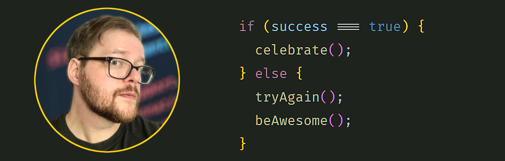

<table>
  <thead>
    <tr>
      <th align="left"> About Me 🚀 </th>
      <th align="left"> Tech Stack 🖳 </th>
    </tr>
  </thead>
  <tbody>
    <tr>
      <td>
        <ul>
          <li> I'm a certified Web Developer looking for my first role!
          <li> I have experience working with HTML, CSS, JavaScript, MERN stack, Third Party APIs, API development, the Bulma and Bootstrap CSS frameworks, and more!
          <li> My background is in team leadership, project planning, and imaging operations for banks. 
          <li> I like games, ttrpgs, pixel art, and learning new things!
        </ul>
      </td>
      <td>
        <ul style="list-style: none; padding: 0;">
             
             
             
             
             
             
             
             
             
            
        </ul>
      </td>
    </tr>
  </tbody>
</table>

 

 

<a href="https://github.com/anuraghazra/convoychat">
  

  

